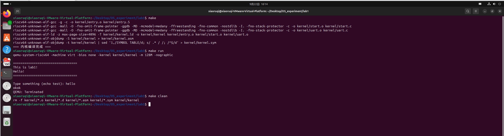

# 实验报告一：RISC-V引导与裸机启动
## 1 实验目标
本次实验的核心目标是深入理解并亲手实现一个最小化操作系统的引导过程。要求参考MIT的xv6-riscv项目，但进行大幅简化，聚焦于最核心的启动步骤。最终，实现在QEMU模拟的RISC-V硬件平台上，通过自行编写的汇编和C代码，成功引导系统并由串口打印出“Hello OS”字符串。
<!-- ## 2 实验环境与工具
* 操作系统：Ubuntu 25.04 LTS 
* 虚拟化平台：VMware Workstation Pro 17
* 核心工具集：
    * git: 用于代码版本控制。
    * make: 用于自动化构建。
    * python3: 辅助脚本所需。
    * qemu-system-riscv64: RISC-V 64位系统模拟器。
    * riscv64-unknown-elf-gcc: RISC-V交叉编译工具链。
    * gdb-multiarch: 多架构调试器，用于调试内核。 -->
  
---
## 2 实验内容
### 2.1 任务1：理解xv6启动流程
#### 2.1.1 阅读 kernel/entry.S，回答以下问题：
* ***为什么第一条指令是设置栈指针？*** 
  
  因为栈是C语言函数调用能够正常工作的前提:entry.S 的最后一条指令是 call start，这将跳转到C语言编写的 start() 函数。在执行这条指令之前，必须已经设置好一个有效的栈空间，否则 start 函数及其内部调用的所有其他函数都将无法正确执行（无法保存返回地址、参数和局部变量），导致立即崩溃或行为不可预测。
* ***la sp, stack0 中的stack0在哪里定义？*** 
  
  在 kernel/start.c中的如下位置定义，这表示为每个CPU核心分配了 4KB（4096字节）的栈空间：
```cpp {.line-numbers}
// entry.S needs one stack per CPU.
__attribute__ ((aligned (16))) char stack0[4096 * NCPU];
```

* ***为什么要清零BSS段？*** 
  
  为了确保所有未初始化的全局变量和静态变量具有确定的初始值（零）:根据C语言标准，BSS段的变量在程序开始时必须被初始化为零。然而，为了节省磁盘空间，编译器不会在内核镜像文件中为这些零值分配空间。因此，内核自己必须在跳转到C代码之前，显式地将这一整块BSS内存清零。如果不做这一步，这些全局变量的值将是随机的，导致程序行为不可预测。
* ***如何从汇编跳转到C函数？*** 
  
  通过RISC-V的 call 指令:汇编代码中的`call start`首先会将下一条指令的地址存入返回地址寄存器 ra，接着将pc设置为函数 start 的地址。

#### 2.1.2 分析 kernel/kernel.ld ，思考：
* ***ENTRY(_entry) 的作用是什么？*** 

    指定程序执行的入口点:当QEMU使用 -kernel 选项加载内核时，CPU会直接从 _entry 标签处的指令开始执行。
* ***为什么代码段要放在0x80000000？*** 
    
    1. 硬件约定：0x80000000 是RISC-V架构中操作系统内核的标准加载地址，QEMU的 -kernel 选项默认将内核镜像加载到这个地址
    2. 技术原因：
        * 地址空间布局：RISC-V将低地址空间（如0x0-0x80000000）保留给用户程序或特定用途，内核放在高地址
        * 内存映射：0x80000000 通常是DRAM的起始地址或内核镜像的固定加载点
        * 符号扩展：这个地址在符号扩展后仍然是正数，避免地址计算问题
* ***etext 、 edata 、 end 符号有什么用途？*** 

    1. etext ：代码段结束地址
    2. edata ：已初始化数据段结束地址
    3. end ：所有已分配内存的结束地址

### 2.2 任务2~6：设计并实现最小启动流程
#### 2.2.1 实验原理与设计
* **RISC-V启动流程图：**
  参照xv6的启动设计，绘制的简化启动流程图如下：
.png)
* **内存布局设计：**
```
0x80000000 +-----------------+
           |     .text       | 代码段
           +-----------------+
           |    .rodata      | 只读数据
           +-----------------+
           |     .data       | 已初始化数据
           +-----------------+
           |     .bss        | 未初始化数据（需清零）
           +-----------------+
           |     Stack       | 栈空间（每个CPU一页）
           +-----------------+
           |   Available     | 可用内存
           +-----------------+
```
* **关键硬件初始化：**
    1. 栈指针设置：为C代码执行准备环境
    2. BSS段清零：确保未初始化变量值为0
    3. 串口初始化：建立调试输出通道
   
#### 2.2.2 实验步骤与实现
**1. 项目结构设计与创建**

参考xv6的项目结构并进行简化，本次实验的项目结构设计如下：
```
lab1/
├── Makefile
└── kernel/
    ├── entry.S
    ├── start.c
    ├── kernel.ld
    ├── uart.c
    └── uart.h
```
**2. 链接脚本实现（kernel.ld）**

链接脚本是内核启动的基础，它定义了内核在内存中的精确布局。考虑到RISC-V架构的特定要求，将入口地址设置为0x80000000，这是QEMU加载内核的标准地址。
实现的关键设计决策：
* 入口点明确：通过ENTRY(_entry)指定汇编入口函数，确保CPU从正确位置开始执行。
* 段顺序固定：严格按照.text→.rodata→.data→.bss的顺序排列，符合程序执行的逻辑流程。
* 符号导出：定义_bss_start和_end符号，为BSS段清零操作提供准确的地址范围。
```ld {.line-numbers}
/* kernel.ld */
OUTPUT_ARCH("riscv")
ENTRY(_entry)

SECTIONS {
    . = 0x80000000;
    
    .text : {
        *(.text .text.*)
    }
    
    .rodata : {
        *(.rodata .rodata.*)
    }
    
    .data : {
        *(.data .data.*)
    }
    
    .bss : {
        _bss_start = .;
        *(.bss .bss.*)
        _end = .;
    }
}

```
**3. 汇编启动代码实现（entry.S）**

汇编启动代码是内核执行的第一段代码，承担着搭建C语言运行环境的关键任务。实现过程分为两个主要阶段：
1. 栈指针设置阶段：
   * 计算栈的起始位置：sp = _end + 4096
   * 为每个CPU核心预留独立的栈空间，避免多核环境下的竞争条件
   * 确保栈指针按页面对齐，满足后续分页机制的要求

2. 环境切换阶段：
   * 使用call指令跳转到C函数，自动保存返回地址
   * 设置安全兜底机制：在start函数返回后进入无限循环，防止执行未知内存代码
```assembly {.line-numbers}
# kernel/entry.S
.section .text
.global _entry
_entry:
    # 设置栈指针（在_end后分配4KB空间）
    la sp, _end
    li t0, 4096
    add sp, sp, t0
    
    # 跳转到C入口函数
    call start

spin:
    j spin
```
**4. 串口驱动实现（uart.h/uart.c）**

串口驱动是内核与外界通信的唯一通道，其实现遵循了硬件编程的最佳实践：
1. 寄存器映射设计：
   * 使用内存映射IO方式访问硬件寄存器
   * 通过基地址+偏移量的方式定义寄存器常量，提高代码可读性
   * 使用volatile关键字确保编译器不优化硬件访问操作

2. 功能模块划分：
   * 初始化函数：配置串口工作模式（8N1格式），启用FIFO缓冲
   * 发送功能：实现阻塞式字符发送，确保数据传输的可靠性
   * 接收功能：提供轮询式字符接收，支持实时输入处理
   * 状态检测：通过LSR寄存器判断设备状态，实现非阻塞检测
  
```c {.line-numbers}
// kernel/uart.c
#include "uart.h"

// UART寄存器基地址（QEMU virt机器的默认地址）
#define UART_BASE 0x10000000

// 寄存器偏移量
#define UART_RHR 0    // 接收保持寄存器（读）
#define UART_THR 0    // 发送保持寄存器（写）
#define UART_IER 1    // 中断使能寄存器
#define UART_FCR 2    // FIFO控制寄存器
#define UART_LCR 3    // 线路控制寄存器
#define UART_LSR 5    // 线路状态寄存器

// 寄存器访问宏
#define REG(r) (*(volatile unsigned char *)(UART_BASE + r))

// LSR寄存器位定义
#define LSR_RX_READY (1 << 0)   // 接收数据就绪
#define LSR_TX_READY (1 << 5)   // 发送保持寄存器空

void uart_init(void) {
    // 禁用中断
    REG(UART_IER) = 0x00;

    // 设置线路控制：8位数据，无奇偶校验，1位停止位
    REG(UART_LCR) = 0x03;
    
    // 启用FIFO，清空FIFO
    REG(UART_FCR) = 0x01;
}

void uart_putc(char c) {
    // 等待发送缓冲区为空
    while ((REG(UART_LSR) & LSR_TX_READY) == 0);
    
    // 发送字符
    REG(UART_THR) = c;
    
    // 如果发送的是换行符，额外发送回车符（\r）
    if (c == '\n') {
        uart_putc('\r');
    }
}

void uart_puts(const char *s) {
    while (*s) {
        uart_putc(*s++);
    }
}

char uart_getc(void) {
    // 等待直到有数据可读
    while ((REG(UART_LSR) & LSR_RX_READY) == 0);
    
    // 读取字符
    return REG(UART_RHR);
}

int uart_has_input(void) {
    // 检查是否有数据可读
    return (REG(UART_LSR) & LSR_RX_READY) != 0;
}
```
**5. 主启动逻辑实现（start.c）**

主启动逻辑是整个内核的控制中心，按照严格的顺序执行初始化任务：
1. BSS段清零阶段：
   * 获取BSS段的准确边界地址（由链接脚本提供）
   * 使用循环逐字节清零，确保所有未初始化变量具有确定值
   * 此操作必须在任何C代码访问全局变量之前完成

2. 硬件初始化阶段：
   * 首先初始化串口，建立调试输出能力
   * 按照依赖关系顺序初始化各硬件模块
   * 每个初始化步骤都包含状态输出，便于调试

3. 主循环设计：
   * 实现简单的回显功能，验证系统基本功能
   * 采用非阻塞式输入检测，提高系统响应性
   * 为后续的功能扩展预留了接口

其中，`start.c`中还额外实现了**交互式回显功能**，实时进行输入检测并进行字符级回显。
```c {.line-numbers}
// kernel/start.c
#include "uart.h"

extern char _bss_start[], _end[];

void clear_bss(void) {
    for (char *p = _bss_start; p < _end; p++) {
        *p = 0;
    }
}

void start(void) {
    // 清零BSS段
    clear_bss();
    
    // 初始化串口
    uart_init();
    
    // 打印启动信息
    uart_puts("\n==================================\n");
    uart_puts("This is lab1!\n");
    uart_puts("Hello!\n");
    uart_puts("==================================\n\n");
    
    // 简单的回显测试
    uart_puts("Type something (echo test): ");
    
    // 主循环：回显用户输入
    while (1) {
        if (uart_has_input()) {
            char c = uart_getc();
            uart_putc(c); // 回显
            
            // 如果收到回车，换行
            if (c == '\r') {
                uart_putc('\n');
            }
        }
    }
}
```
**6. 构建系统实现（Makefile）**

参照xv6的makefile文件，删去了冗余部分，仅保留实验一相关的核心内容。
```Makefile {.line-numbers}
K=kernel

# 最小内核所需的目标文件
OBJS = \
  $K/entry.o \
  $K/start.o \
  $K/uart.o

# 工具链前缀（自动检测）
ifndef TOOLPREFIX
TOOLPREFIX := $(shell if riscv64-unknown-elf-objdump -i 2>&1 | grep 'elf64-big' >/dev/null 2>&1; \
	then echo 'riscv64-unknown-elf-'; \
	elif riscv64-linux-gnu-objdump -i 2>&1 | grep 'elf64-big' >/dev/null 2>&1; \
	then echo 'riscv64-linux-gnu-'; \
	else echo ""; fi)
endif

# QEMU命令
QEMU = qemu-system-riscv64

# 编译工具
CC = $(TOOLPREFIX)gcc
LD = $(TOOLPREFIX)ld
OBJCOPY = $(TOOLPREFIX)objcopy
OBJDUMP = $(TOOLPREFIX)objdump

# 编译选项
CFLAGS = -Wall -O -fno-omit-frame-pointer -ggdb
CFLAGS += -MD
CFLAGS += -mcmodel=medany
CFLAGS += -ffreestanding -fno-common -nostdlib
CFLAGS += -I.
CFLAGS += -fno-stack-protector

# 链接选项
LDFLAGS = -z max-page-size=4096

# 主要目标：生成内核可执行文件
$K/kernel: $(OBJS) $K/kernel.ld
	$(LD) $(LDFLAGS) -T $K/kernel.ld -o $K/kernel $(OBJS)
	$(OBJDUMP) -S $K/kernel > $K/kernel.asm
	$(OBJDUMP) -t $K/kernel | sed '1,/SYMBOL TABLE/d; s/ .* / /; /^$$/d' > $K/kernel.sym
	@echo "=== 内核编译完成 ==="

# 汇编文件编译规则
$K/%.o: $K/%.S
	$(CC) -g -c -o $@ $<

# C文件编译规则
$K/%.o: $K/%.c
	$(CC) $(CFLAGS) -c -o $@ $<

# QEMU运行配置
QEMUOPTS = -machine virt -bios none -kernel $K/kernel -m 128M -nographic

# 运行内核
run: $K/kernel
	$(QEMU) $(QEMUOPTS)

# 清理生成文件
clean:
	rm -f $K/*.o $K/*.d $K/*.asm $K/*.sym $K/kernel

# 包含依赖文件
-include $K/*.d

.PHONY: all run clean
```

#### 2.2.3 实验测试与结果
* **编译及运行结果**
终端输入`make`指令进行编译，之后输入`make run`运行，屏幕成功显示：`This is lab1！ Hello！`并提示`Type something`允许用户输入字符实时回显。
运行截图如下：

* **功能验证**
- 内核成功从0x80000000启动
- BSS段正确清零
- 栈指针正确设置
- 串口输入输出功能正常
- 回显功能正常工作


---
## 3 所遇问题与解决
由于本次实验相对简单，参考xv6的实现可以比较顺利地完成，因此没有遇到比较困难的问题。

---
## 4 思考题
### 4.1 启动栈的设计：
* ***你如何确定栈的大小？考虑哪些因素？***

    本次实验选用4KB的典型选择。具体考量了：

    1. 函数调用深度：启动阶段调用链较浅
    2. 局部变量大小：避免大数组在栈上分配  
    3. 中断上下文：保存寄存器需要~256字节
    4. 对齐要求：RISC-V需要16字节对齐
    5. 安全边际：预留空间应对意外情况
* ***如果栈太小会发生什么？如何检测栈溢出？***
  
    1. 如果栈太小可能导致栈溢出，最终致使数据损坏、代码崩溃等。
    2. 可以利用栈边界检查检测栈溢出。如以下代码：
    ```cpp {.line-numbers}
    uint64 stack_top = STACK_BASE;
    uint64 stack_bottom = STACK_BASE - STACK_SIZE;

    void stack_check(void) {
        uint64 current_sp;
        asm volatile("mv %0, sp" : "=r"(current_sp));
        
        if (current_sp < stack_bottom) {
            uart_puts("STACK OVERFLOW!\n");
            while(1);  // 停机
        }
    }
    ```
### 4.2 BSS段清零：
* ***写一个全局变量，不清零BSS会有什么现象？***

    可能会有以下现象：
    1. 变量值取决于内存之前的残留数据
    2. 程序行为不可预测，难以调试
    3. 可能今天正常，明天崩溃
* ***哪些情况下可以省略BSS清零？***

    1. 引导加载器已清零：某些bootloader会清理内存
    2. 硬件保证：某些嵌入式芯片上电后内存自动清零
    3. 安全环境：内存之前未被使用（如模拟器冷启动）
    4. 不使用BSS变量：所有变量都显式初始化
### 4.3 与xv6的对比：
* ***你的实现比xv6简化了哪些部分？***

    |模块|xv6实现|我的简化实现|
    |:------: |:------: |:------: |
    |进程管理|	完整PCB、调度器|	单任务，无进程	|
    |内存管理	|多级页表、kmalloc	|物理页分配器|	
    |文件系统	|inode、日志、缓存|	无文件系统	|
    |设备驱动	|控制台、磁盘、时钟	|仅UART驱动|	
    |系统调用	|陷入机制、权限检查|	直接函数调用|	
    |并发控制	|自旋锁、睡眠锁	|禁用中断|	

* ***这些简化在什么情况下会成为问题？***
  
  1. 需要运行用户程序时：我的系统只能运行内核代码，无法加载和执行外部程序。
  2. 需要调试时：我的系统只能简单提示，没有xv6那样完整的panic和backtrace。
  3. 等等。
### 4.4 错误处理：
* ***如果UART初始化失败，系统应该如何处理？***

    系统处理如下：
    ```cpp {.line-numbers}
    int uart_init(void) {
    // 尝试访问UART寄存器
    uint8_t test_value = 0xAA;
    REG(UART_THR) = test_value;
    
    // 检查是否可写
    if (REG(UART_THR) != test_value) {
        return -1;  // 初始化失败
    }
    
    // 配置寄存器
    REG(UART_LCR) = 0x03;
    
    // 验证配置
    if (REG(UART_LCR) != 0x03) {
        return -2;  // 配置失败
    }
    
    return 0;  // 成功
    }

    void start(void) {
        if (uart_init() != 0) {
            // UART不可用，进入最小错误模式
            emergency_halt();
        }
        // 正常启动流程...
    }
    ```
* ***如何设计一个最小的错误显示机制？***

    可以使用内存标记法，在固定内存地址记录错误信息：
    ```cpp {.line-numbers}
    #define ERROR_ADDR 0x8000FF00

    void record_error(int code, const char *msg) {
        volatile uint32_t *error_code = (uint32_t*)ERROR_ADDR;
        volatile char *error_msg = (char*)(ERROR_ADDR + 4);
        
        *error_code = code;
        for (int i = 0; msg[i] && i < 60; i++) {
            error_msg[i] = msg[i];
        }
        error_msg[60] = '\0';
    }
    ```
---
## 5 实验总结
本次实验成功实现了一个基于RISC-V架构的最小化操作系统内核启动流程。通过精心设计的代码结构和模块化实现，完成了从硬件上电到交互式命令行环境的完整引导过程。实验不仅达到了所有基本要求，还额外实现了交互式回显功能，为后续操作系统开发奠定了坚实基础。