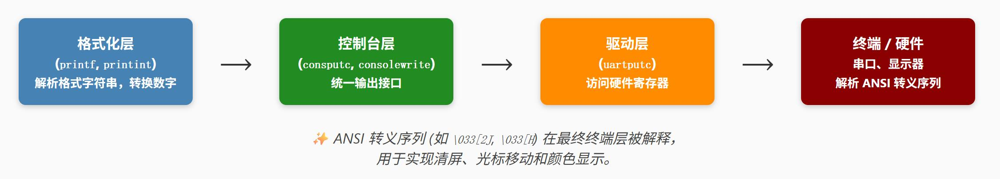
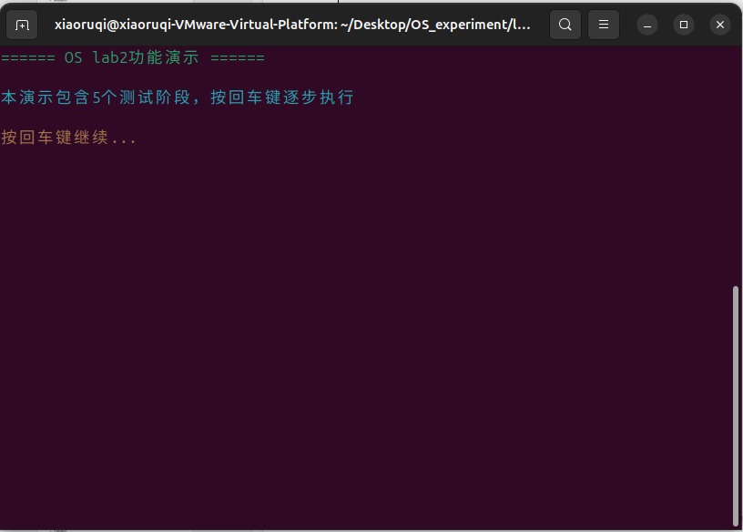
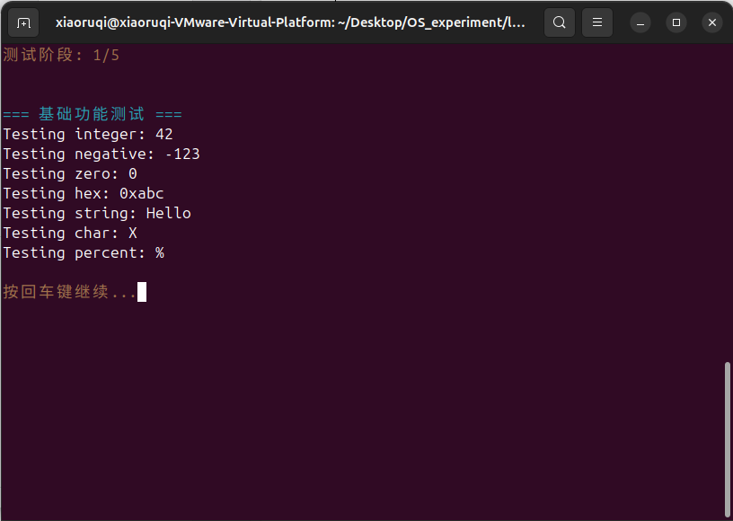
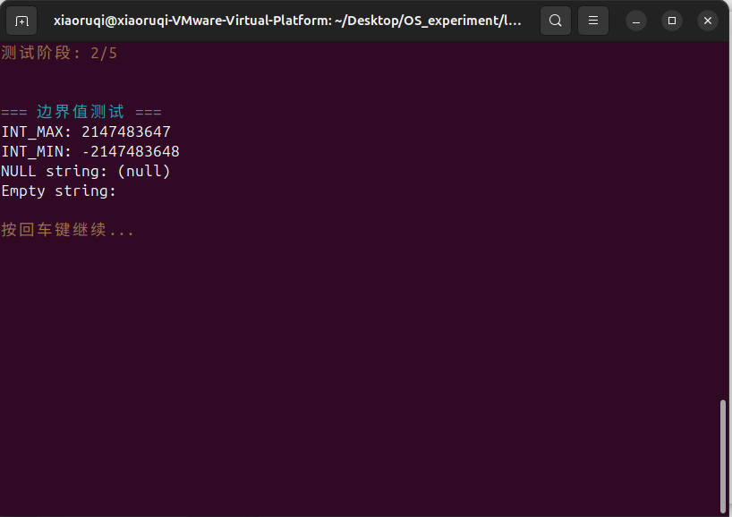
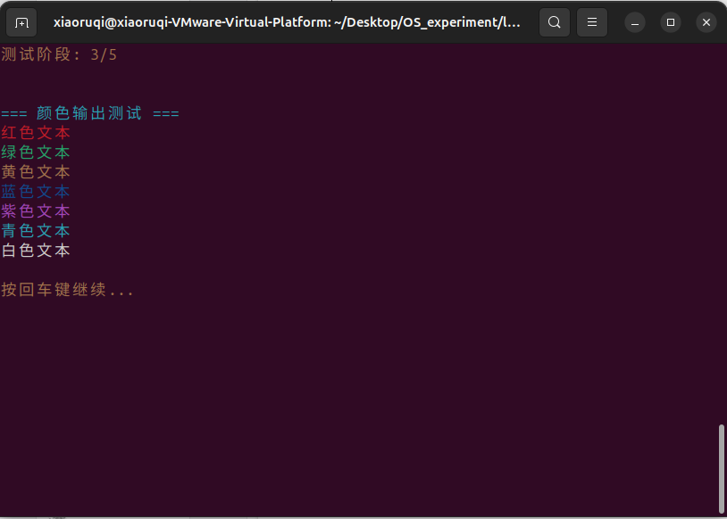
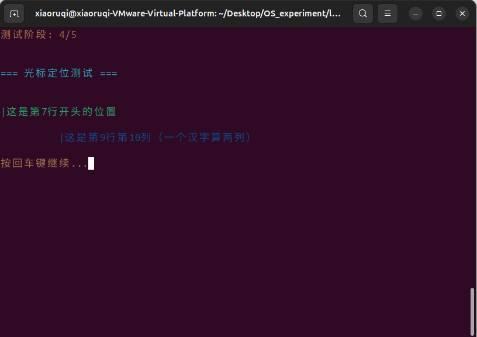
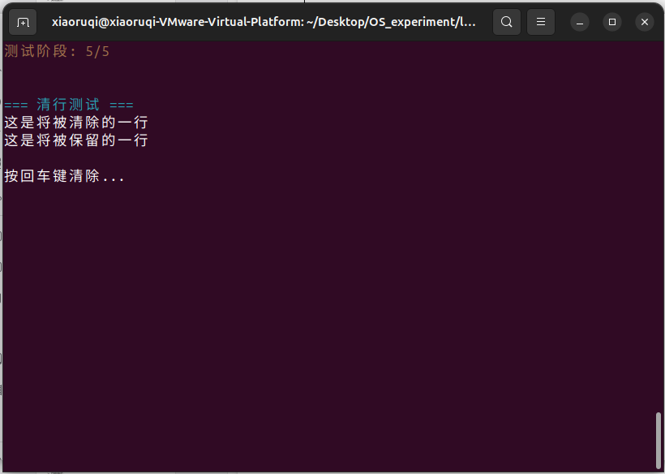
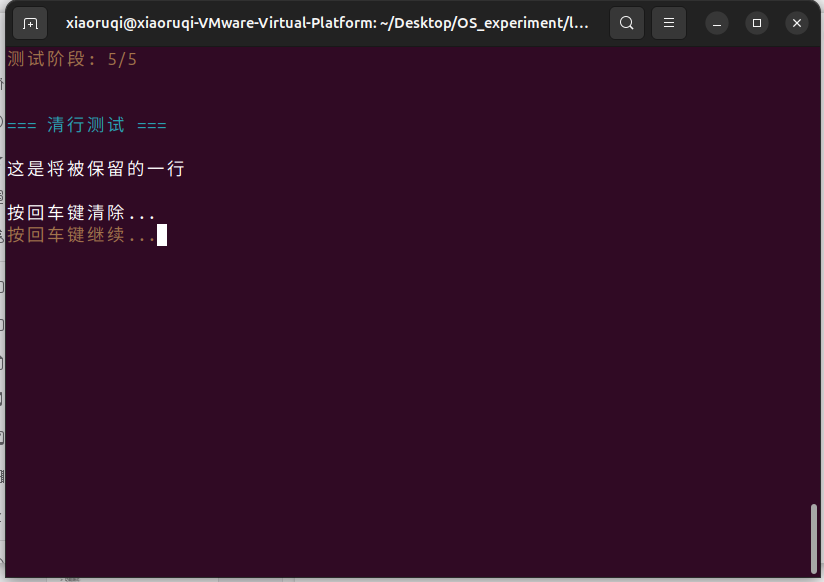

# 实验报告二：内核printf与清屏功能实现
## 1 实验目标
本实验旨在深入理解操作系统内核输出系统的设计原理，通过分析xv6的printf实现机制，独立设计并实现一个功能完整的内核级格式化输出系统，具体目标包括：
1. 理解内核输出特殊性：掌握内核为何不能依赖用户态库函数
2. 实现格式化输出：支持%d、%x、%s、%c、%%等基本格式符
3. 实现清屏功能：基于ANSI转义序列实现终端清屏
4. 构建分层架构：设计硬件驱动层、格式化层的清晰接口

---
## 2 实验内容
### 2.1 任务1：深入理解xv6输出架构
#### 2.1.1 研读 printf.c 中的核心函数：
* ***printf() 如何解析格式字符串？*** 
  
  xv6使用状态机方式解析格式字符串，具体解析策略如下：
  * 逐字符扫描，遇到 % 进入格式解析模式
  * 预读后续2个字符（c0, c1, c2）进行最长匹配
  * 使用 va_arg(ap, 类型) 提取可变参数
* ***printint() 如何处理不同进制转换？*** 
  
  ```cpp {.line-numbers}
  do {
    buf[i++] = digits[x % base];  // 关键：digits数组索引
    } while((x /= base) != 0);
  ```
  正如以上代码，预定义`digits[] = "0123456789abcdef"`包含所有进制字符，再利用`x % base`得到当前最低位数字、利用`x /= base`移除已处理的最低位，循环直到`x == 0`即完成转换。
* ***负数处理有什么特殊考虑？*** 
  
  ```cpp {.line-numbers}
  if(sign && (sign = (xx < 0)))  // 检查是否需要符号处理
        x = -xx;                   // 转为正数处理
    else
        x = xx;

    // ... 转换完成后
    if(sign)
        buf[i++] = '-';            // 最后添加负号
  ```
  代码中统一将有符号数转为无符号数处理，避免符号位干扰，转换完成后再统一添加负号。此外，支持 sign 参数控制是否进行符号处理（%u 不需要）

#### 2.1.2 理解分层设计：

* ***每一层的职责是什么？*** 
  
  * 格式化层：负责解析%d、%s等格式符，将数字转换为字符串，处理可变参数。它完成数据到文本的转换，但不关心输出目标。
  * 控制台层：作为中间抽象层，提供统一的输出接口，可以管理多个输出设备（串口、显示器等），决定字符路由和设备选择。
  * 驱动层：直接操作硬件寄存器，负责设备初始化、状态监控和数据传输，是软件与硬件的桥梁。
  * 终端/硬件层：执行最终的字符显示和ANSI转义序列解释，如清屏(\033[2J)、光标控制等物理操作。
* ***这种设计有什么优势？*** 
  
  * 模块化清晰：每层职责单一，修改格式化逻辑不影响硬件驱动，更换硬件只需重写驱动层，大幅提升可维护性。
  * 可移植性强：通过硬件抽象层，同一套printf代码可在不同平台（RISC-V、ARM等）和设备（串口、显示器）上运行。
  * 扩展灵活：添加新输出设备只需在控制台层注册，无需修改上层代码，支持输出重定向和多设备并行输出。
  * 健壮性高：错误被隔离在单层内，驱动故障不会导致系统崩溃，可实现优雅降级（如串口故障改用网络输出）。
  * 便于测试：可逐层测试，用模拟驱动替代真实硬件进行自动化测试，调试时能快速定位问题层级。

#### 2.1.3 深入思考：
* ***xv6为什么不使用递归进行数字转换？*** 

    递归可能存在以下问题：
    * 栈溢出风险：数字转换深度有限（最多20位），但内核栈很小
    * 性能开销：函数调用、参数传递、栈帧分配
* ***printint() 中处理 INT_MIN 的技巧是什么？*** 
  
  INT_MIN = -2147483648，-INT_MIN 会溢出。因此，xv6选择使用 unsigned long long，可以安全容纳32位INT_MIN的绝对值，避免溢出。
* ***如何实现线程安全的printf？*** 
  
  xv6通过自旋锁实现线程安全，具体的线程安全机制包含如下内容：
  * 互斥访问：防止多个CPU同时调用printf导致输出交错
  * panic特殊处理：panic时不加锁，避免死锁
  * 轻量级：自旋锁比互斥锁更适合内核短临界区


### 2.2 任务2~6：设计并实现内核printf与清屏功能
#### 2.2.1 实验原理与设计
* **系统架构图设计**
  
  本实验设计的简化系统架构图如下：
  ```
    ┌─────────────────────────────────────────┐
    │            格式化层 (Format Layer)       │
    ├─────────────────────────────────────────┤
    │ • printf(const char *fmt, ...)          │
    │ • printf_color(color_t, const char*, ...)│
    │ • print_number(int, int, int)           │
    │ • 格式解析、数字转换、颜色控制             │
    └───────────────────┬─────────────────────┘
                        │
    ┌───────────────────▼─────────────────────┐
    │          驱动层 (Driver Layer)           │
    ├─────────────────────────────────────────┤
    │ • uart_putc(char c)                     │
    │ • uart_puts(const char *s)              │
    │ • uart_getc(void)                       │
    │ • 硬件寄存器操作、设备控制                │
    └───────────────────┬─────────────────────┘
                        │
    ┌───────────────────▼─────────────────────┐
    │          硬件层 (Hardware Layer)         │
    ├─────────────────────────────────────────┤
    │ • UART 16550 串口控制器                  │
    │ • ANSI终端/显示器                        │
    │ • 物理设备操作                           │
    └─────────────────────────────────────────┘
    ```

* **各层接口定义**
  1. 格式化层接口 (printf.h)：
   ```cpp {.line-numbers}
   // 基础输出功能
    int printf(const char *fmt, ...);
    void print_number(int num, int base, int sign);

    // 增强显示功能  
    void clear_screen(void);
    void clear_line(void);
    void goto_xy(int x, int y);
    int printf_color(color_t color, const char *fmt, ...);

    // 测试控制
    void wait_for_enter(int x);
   ```
  2. 驱动层接口 (uart.h)：
   ```cpp {.line-numbers}
   // 设备初始化
    void uart_init(void);

    // 字符级操作
    void uart_putc(char c);
    char uart_getc(void);

    // 字符串级操作  
    void uart_puts(const char *s);
    int uart_has_input(void);
   ```
* **与xv6设计的异同分析**
  **1. 相同点：**
    * 都采用分层架构，分离格式化逻辑与硬件操作
    * 都使用状态机解析格式字符串
    * 都支持基本的格式符(%d, %x, %s, %c, %%)
    * 都采用迭代算法进行数字转换，避免递归栈溢出
  **2. 不同点：**
   
    | 特性 | xv6设计 | 本实验设计 | 设计理由 |
    |------|---------|------------|----------|
    | 架构层次 | 三层(格式化+控制台+驱动) | 两层(格式化+驱动) | 简化设计，减少函数调用开销 |
    | 并发安全 | 自旋锁保护多核并发 | 无锁，单核假设 | 教学环境简化 |
    | 功能扩展 | 基础格式化功能 | 增强显示(颜色+光标) | 提升用户体验 |
    | 错误处理 | 复杂panic机制 | 简单空指针保护 | 聚焦核心功能 |
    | 缓冲机制 | 有输出缓冲 | 直接字符输出 | 降低实现复杂度 |


    
#### 2.2.2 实验步骤与实现

**1. 实验步骤记录**

**阶段一：基础框架搭建**
  1. 分析xv6源码：深入研究`printf.c`的状态机解析逻辑和`printint`的数字转换算法
  2. 设计接口规范：定义清晰的层间接口，确保模块化设计
  3. 实现UART驱动：完成最基本的字符输出功能，验证硬件通路正常

**阶段二：核心功能实现**  
  1. 可变参数处理：使用`stdarg.h`实现`va_list`参数提取，支持不定参数
  2. 格式解析状态机：实现`%d`、`%x`、`%s`等格式符的识别和处理
  3. 数字转换算法：采用迭代逆序法，重点解决INT_MIN边界情况

**阶段三：增强功能开发**
  1. ANSI转义序列：实现`\033[2J`清屏、`\033[x;yH`光标定位
  2. 颜色输出支持：扩展`printf_color`函数，支持8种基本颜色
  3. 交互功能完善：添加`wait_for_enter`实现测试流程控制

**阶段四：系统集成测试**
  1. 分层测试验证：先测试驱动层，再测试格式化层，最后集成测试
  2. 边界条件测试：重点验证零值、INT_MAX、INT_MIN、空指针等特殊情况
  3. 性能稳定性测试：连续输出测试，验证无字符丢失和系统稳定性

**2. 核心关键代码理解总结**

* **关键代码1：数字转换算法（解决INT_MIN边界）。** 用无符号运算解决边界溢出，迭代算法保证栈安全。
```cpp {.line-numbers}
void print_number(int num, int base, int sign) {
    char buf[16];
    int i = 0;
    unsigned int unum;  // 关键：使用无符号数避免溢出
    int neg = 0;

    // INT_MIN特殊处理：-(-2147483648)会溢出，用无符号运算
    if (sign && num < 0) {
        neg = 1;
        unum = (unsigned int)(-num);  // 无符号转换避免溢出
    } else {
        unum = (unsigned int)num;
    }
    
    // 迭代算法替代递归，避免内核栈溢出
    do {
        buf[i++] = digits[unum % base];  // 逆序存储
        unum /= base;
    } while (unum > 0);
    
    // 逆序输出得到正确顺序
    while (--i >= 0) {
        uart_putc(buf[i]);
    }
}
```


* **关键代码2：格式解析状态机。** 用状态机模式实现格式解析，结构清晰易扩展。
```c {.line-numbers}
int printf(const char *fmt, ...) {
    va_list ap;
    va_start(ap, fmt);
    
    for (int i = 0; fmt[i] != '\0'; i++) {
        if (fmt[i] != '%') {
            uart_putc(fmt[i]);  // 普通字符状态
            continue;
        }
        
        i++; // 进入格式解析状态
        switch (fmt[i]) {
            case 'd': 
                print_number(va_arg(ap, int), 10, 1);  // 十进制
                break;
            case 'x':
                print_number(va_arg(ap, int), 16, 0);  // 十六进制  
                break;
            // 其他格式符处理...
        }
    }
    va_end(ap);
    return 0;
}
```

* **关键代码3：ANSI清屏与光标控制。** 遵循ANSI标准化实现，确保终端兼容性。
```c {.line-numbers}
void clear_screen(void) {
    uart_puts("\033[2J");  // ED命令：清除整个屏幕
    uart_puts("\033[H");   // CUP命令：光标归位
}

void goto_xy(int x, int y) {
    printf("\033[%d;%dH", y + 1, x + 1);  // 行列定位(1-based)
}

int printf_color(color_t color, const char *fmt, ...) {
    printf("\033[3%dm", color);  // 设置前景色
    // 格式化输出...
    printf("\033[0m");           // 重置属性
}
```

* **关键代码4：硬件寄存器精确操作。** 状态检查确保传输可靠性，换行符转换提升兼容性。
```c {.line-numbers}
void uart_putc(char c) {
    while ((REG(UART_LSR) & LSR_TX_READY) == 0);  // 等待就绪
    REG(UART_THR) = c;  // 写入发送寄存器
    
    if (c == '\n') {
        uart_putc('\r');  // 换行转换：\n -> \r\n
    }
}
```

#### 2.2.3 实验测试与结果

  终端输入`make`指令进行编译，之后输入`make run`运行，进入如下的开始测试界面。
  
  **1. 基础功能测试：**

   验证printf基本格式化功能，包括整数、字符串、字符、十六进制等格式符的正确解析和输出。测试涵盖正数、负数、零值等常规情况。  
   输出结果如下图：
   
  **2. 边界情况测试：**

   重点测试系统在极端输入下的稳定性，包括INT_MAX、INT_MIN等数值边界，空指针、空字符串等异常输入，以及未知格式符的错误恢复能力。  
   输出结果如下图：
   
  **3. 颜色输出测试：**

   验证ANSI颜色转义序列的实现效果，测试8种基本颜色在终端中的实际显示效果，验证颜色设置和重置功能是否正常。  
   输出结果如下图，所有颜色正确显示：
   
  **4. 光标控制测试：**

   测试光标控制功能的准确性，验证goto_xy函数能否精确定位到指定行列位置，检查坐标计算的正确性。  
   输出结果如下图，光标精确定位到第7行开头显示绿色标记线，随后定位到第9行第10列显示蓝色标记，定位准确无偏差。
   
  **5. 清屏清行测试：**

   由于每一轮测试展示时，都调用了`clean_screen()`函数，进行一次清屏，因此这里不再对清屏功能单独测试，这里重点测试清行功能。  
   * 首先显示测试内容后提示用户"按回车键清除"，如下图：
   
   * 待用户按键后特定行内容被精确清除而其他行保留，演示动态界面更新效果。效果如下：
   

---
## 3 所遇问题与解决
由于本次实验相对简单，参考xv6的实现可以比较顺利地完成，因此没有遇到比较困难的问题。

---
## 4 思考题
### 4.1 架构设计：
* ***为什么需要分层？每层的职责如何划分？***
  
  内核输出系统分层主要解决三个核心问题——硬件差异抽象、功能逻辑分离和代码维护性。通过分层，将易变的硬件操作与稳定的业务逻辑解耦，提高系统可移植性和可维护性。
* ***如果要支持多个输出设备（串口+显示器），架构如何调整？***
  
  如需支持串口+显示器双输出，架构可以进行如下调整：
  1. 增加设备抽象接口，统一uart和vga的操作方法
  2. 控制台层实现输出路由策略（同步/异步、主备切换等）
  3. 添加设备管理模块，动态检测设备可用状态
### 4.2 算法选择：
* ***数字转字符串为什么不用递归？***
  
  在2.1.3节已讨论过该问题。
* ***如何在不使用除法的情况下实现进制转换？***
  
  可以使用查表法——预计算各进制的幂次表，通过比较和减法实现转换：
  ```cpp {.line-numbers}
  // 例如十进制转十六进制
    const uint32_t hex_powers[] = {0x10000000, 0x1000000, ..., 0x10, 0x1};

    void print_hex_no_divide(uint32_t n) {
        for (int i = 0; i < 8; i++) {
            int digit = 0;
            while (n >= hex_powers[i]) {
                n -= hex_powers[i];
                digit++;
            }
            uart_putc(digits[digit]);
        }
    }
  ```
### 4.3 性能优化：
* ***当前实现的性能瓶颈在哪里？***
  
  1. 字符级传输：每个字符单独检查UART状态，大量CPU时间浪费在等待循环
  2. 无缓冲机制：频繁的小数据量传输，无法利用硬件批量传输优势
  3. 格式解析开销：每次printf都要重新解析格式字符串
* ***如何设计一个高效的缓冲机制？***
  
  可以采用双缓冲+批量传输方案：
  ```cpp {.line-numbers}
    #define BUF_SIZE 256
    struct output_buffer {
        char data[BUF_SIZE];
        int count;
        int device_id;  // 支持多设备
    };

    // 缓冲输出函数
    void buffered_printf(const char *fmt, ...) {
        if (buffer.count + estimated_len > BUF_SIZE) {
            flush_buffer();  // 缓冲区满时触发传输
        }
        // 格式解析结果直接写入缓冲区
        append_to_buffer(formatted_data);
    }

    // 条件刷新机制
    void flush_buffer(void) {
        if (buffer.count > 0) {
            dma_transfer(buffer.data, buffer.count);  // DMA批量传输
            buffer.count = 0;
        }
    }
  ```
  通过这种方案，可以减少90%以上的状态检查开销；同时支持DMA批量传输，能够释放CPU资源并提升吞吐量。
### 4.4 错误处理：
* ***printf遇到NULL指针应该如何处理？***
  
  采用分级处理方案：
  ```cpp {.line-numbers}
    case 's': {
        char *s = va_arg(ap, char*);
        if (s == NULL) {
            // 方案1：安全输出
            uart_puts("(null)");
            // 方案2：调试信息
            uart_puts("[NULL_PTR]");
            // 方案3：容错恢复
            log_error("NULL string pointer");
            break;
        }
        uart_puts(s);
    }
  ```
* ***格式字符串错误时的恢复策略是什么？***
  
  采用状态机容错机制：
  ```cpp {.line-numbers}
    for (int i = 0; fmt[i] != '\0'; i++) {
        if (fmt[i] != '%') {
            uart_putc(fmt[i]);
            continue;
        }
        
        i++; // 跳过%
        if (fmt[i] == '\0') {
            uart_putc('%');  // 字符串以%结束
            break;
        }
        
        switch (fmt[i]) {
            // 已知格式符处理...
            default:
                // 未知格式符：原样输出%和字符
                uart_putc('%');
                uart_putc(fmt[i]);
                log_warning("Unknown format: %%%c", fmt[i]);
                break;
        }
    }
  ```

---
## 5 实验总结
通过本次实验，我深入掌握了内核级输出系统的设计与实现，从xv6的复杂架构分析到自主设计简化的两层模型，成功实现了支持格式化输出、颜色显示和清屏功能的完整系统。实验过程中遇到的INT_MIN边界处理、ANSI转义序列兼容性、状态机解析等实际问题，锻炼了我底层编程和调试能力。更重要的是，这次实践让我深刻理解了内核开发与用户态编程的本质差异——内核必须自给自足，不能依赖外部库，所有功能都需要从硬件寄存器操作开始逐层构建。这种从零搭建系统组件的经验，不仅巩固了操作系统理论知识，更为后续更深层次的内核开发奠定了坚实基础。