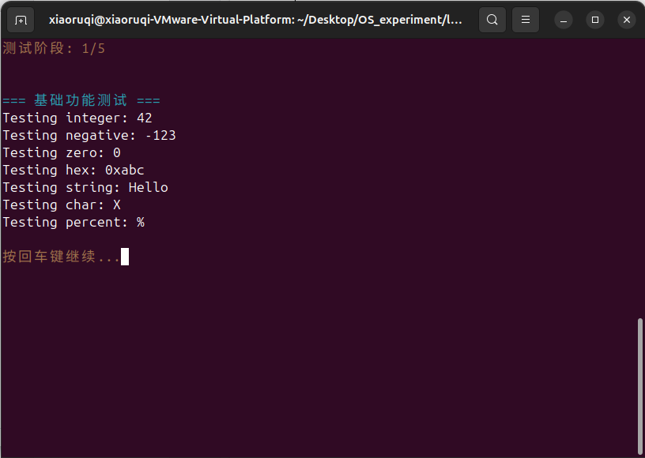
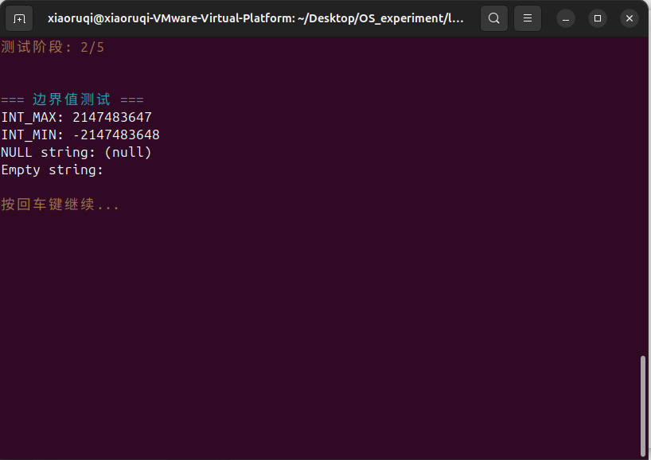
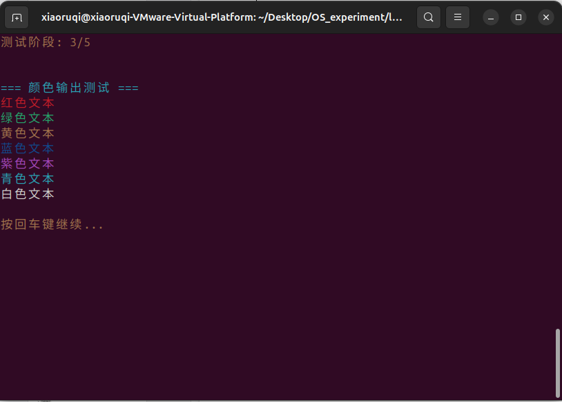
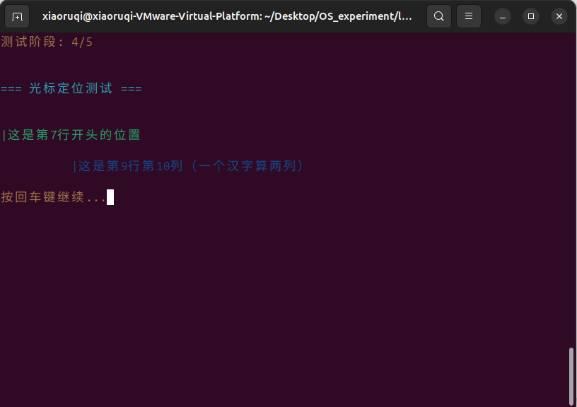
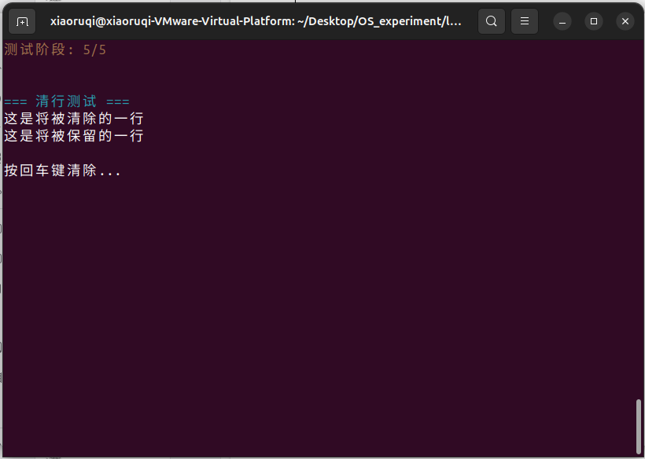
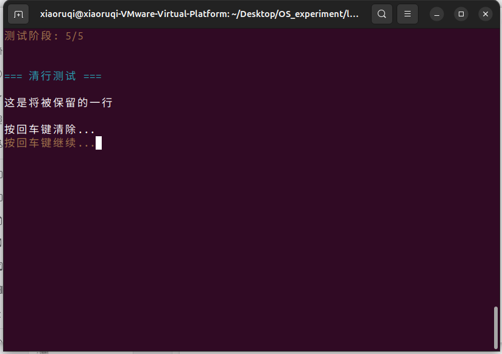

# Lab2: 内核printf与清屏功能实现

## 项目简介
在Lab1最小内核基础上，实现完整的内核级格式化输出系统，包含printf格式化输出、ANSI清屏、颜色显示和光标控制功能。

## 项目结构
```
lab2/
├── Makefile              # 构建配置
└── kernel/
    ├── kernel.ld         # 内存布局
    ├── printf.h          # printf接口定义
    ├── printf.c          # 格式化输出实现
    ├── uart.h            # 串口驱动接口
    ├── uart.c            # 增强串口驱动
    ├── entry.S           # 启动代码
    └── main.c            # 测试主程序
```

## 功能特性
- ✅ 完整printf格式化（%d, %x, %s, %c, %%）
- ✅ ANSI清屏与清行
- ✅ 光标定位
- ✅ 8色文本输出支持
- ✅ 交互式分阶段测试（额外）

## 快速开始

### 环境要求
```bash
# Ubuntu/Debian 安装（同Lab1）
sudo apt install gcc-riscv64-unknown-elf qemu-system-misc make
```

### 编译运行
```bash
make        # 编译内核
make qemu   # 在QEMU中运行
# make clean  # 可选清理
```

### 退出方式
在QEMU窗口中按 `Ctrl+A`，然后按 `X` 退出模拟器。

## 测试验证流程

### 阶段1：基础格式化功能测试
**测试内容**：验证printf基本格式化输出，包括整数、字符串、字符、十六进制等格式符
**预期效果**：屏幕显示各种格式的正确输出，如"Testing integer: 42"、"Testing hex: 0xabc"等


### 阶段2：边界条件与健壮性测试  
**测试内容**：测试极端输入处理，包括INT_MAX/INT_MIN边界值、空指针、未知格式符等
**预期效果**：正确显示边界数值，空指针显示"(null)"，未知格式符优雅降级


### 阶段3：颜色输出功能测试
**测试内容**：验证ANSI颜色转义序列，测试8种基本颜色显示效果
**预期效果**：屏幕依次显示红、绿、黄、蓝等彩色文本，颜色鲜明切换流畅


### 阶段4：光标定位精度测试
**测试内容**：测试goto_xy函数的光标定位准确性
**预期效果**：光标精确定位到第7行和第9行指定位置显示标记线


### 阶段5：清屏清行交互测试
**测试内容**：综合测试清屏和清行功能，结合用户交互验证动态界面更新
**预期效果**：按回车键后特定行内容被精确清除，演示动态显示控制能力



## 验证效果
程序启动后自动进入5阶段测试流程，每个阶段都有明确的功能说明。按回车键逐步执行，可观察到：
- 格式化输出的正确性和完整性
- 颜色文本的视觉区分效果  
- 光标定位的精确性
- 清屏清行的动态更新效果

**交互提示**：每个测试阶段结束后会显示"按回车键继续..."，按照提示操作即可完成全部功能验证。