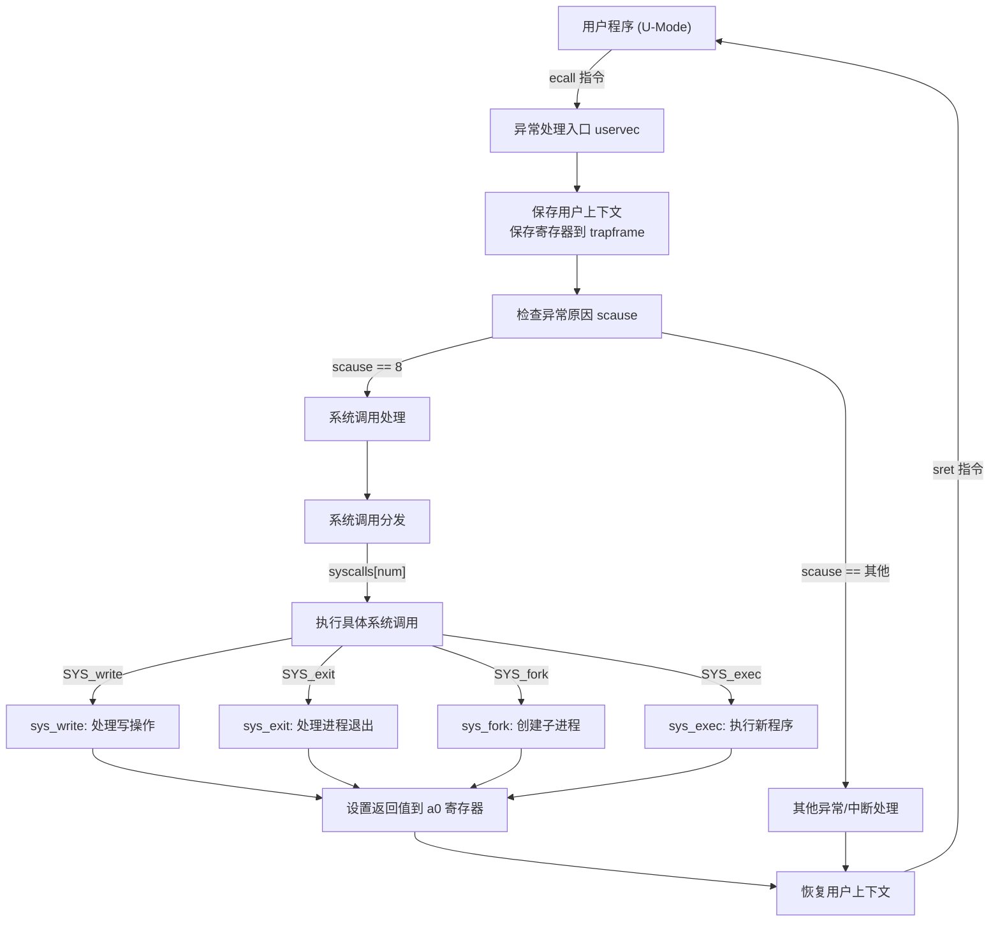

# 实验报告六：系统调用 


## 1\. 实验概述

### 1.1 实验目标

本实验旨在打通用户态与内核态的交互边界，设计并实现一套完整的系统调用框架。具体目标包括：完善内核异常处理机制以捕获 `ecall` 指令；实现系统调用参数解析与分发器；并构建 `sys_write`、`sys_exit`、`sys_fork` 等核心系统调用，使应用程序能够安全地请求内核服务。

### 1.2 完成情况

  - [x] **异常捕获**：在 `usertrap` 中增加了对 `scause=8`（用户态环境调用）的处理逻辑，修复了 `epc` 指针回环问题。
  - [x] **分发框架**：实现了基于函数指针数组的 `syscall` 分发器，支持系统调用号的合法性检查。
  - [x] **参数解析**：编写了 `argint`、`argaddr` 和 `fetchstr` 函数，实现了跨特权级的数据安全访问。
  - [x] **功能实现**：
      - 进程管理：`sys_getpid`、`sys_exit`、`sys_fork`、`sys_wait`。
      - 基础 I/O：`sys_write`（基于控制台输出）。
      - 时间管理：`sys_sleep`。
  - [x] **安全性验证**：通过了无效指针和越界文件描述符的安全性测试。

### 1.3 开发环境

  - **操作系统**: Ubuntu 22.04 LTS (WSL2)
  - **工具链**: riscv64-unknown-elf-gcc 10.2.0
  - **模拟器**: QEMU emulator version 7.0.0

-----

## 2\. 技术设计

### 2.1 系统架构设计

系统调用是连接 User Mode 和 Supervisor Mode 的桥梁。我的设计遵循 RISC-V ABI 规范，采用“统一入口、查表分发”的架构。

**架构流程图：**



**与 xv6 的对比：**

  - **一致性**：沿用了 xv6 的 `trapframe` 结构来保存用户寄存器，利用 `a7` 传递调用号，`a0-a5` 传递参数。
  - **简化**：在文件系统尚未完全就绪的情况下，`sys_write` 暂时绕过了完整的 VFS 层，直接调用底层 `consolewrite` 实现字符输出，以便专注于理解特权级切换流程。

### 2.2 关键数据结构

核心数据结构主要围绕 `struct proc` 中的 `trapframe` 展开。

```c
// 进程陷阱帧 (kernel/proc.h)
struct trapframe {
  /* 0 */ uint64 kernel_satp;   // 内核页表
  /* 8 */ uint64 kernel_sp;     // 内核栈顶
  /* 16 */ uint64 kernel_trap;   // usertrap地址
  /* 24 */ uint64 epc;           // 保存的 SEPC (ecall指令地址)
  /* 32 */ uint64 kernel_hartid; // 核心ID
  /* 40 */ uint64 ra;
  // ...
  /* 112 */ uint64 a0;            // 参数0 / 返回值
  /* 120 */ uint64 a1;            // 参数1
  /* 168 */ uint64 a7;            // 系统调用号
  // ...
};
```

**设计理由**：

  - **硬件解耦**：`trapframe` 位于用户地址空间的固定高地址（TRAMPOLINE 下方），使得内核在切换页表前就能保存寄存器。
  - **参数传递**：内核不直接从堆栈取参，而是从 `trapframe` 中读取保存的寄存器值，这符合 RISC-V 寄存器传参的高效特性。

### 2.3 核心算法与流程

**异常处理流程（usertrap）**：

1.  **检查中断源**：读取 `scause` 寄存器。
2.  **判别系统调用**：若 `scause == 8`：
      * **PC 修正**：执行 `p->trapframe->epc += 4`。这是关键一步，因为 `ecall` 是精确异常，返回地址默认指向指令本身。若不修正，将导致死循环。
      * **开启中断**：调用 `intr_on()`，允许系统调用执行期间响应中断（如时钟），提高系统并发度。
      * **调用分发**：执行 `syscall()`。
3.  **结果反馈**：将内核函数的返回值写入 `p->trapframe->a0`。

-----

## 3\. 实现细节与关键代码

### 3.1 系统调用分发器 (`kernel/syscall.c`)

这是内核处理请求的总入口。为了安全，必须对调用号进行边界检查。

```c
void syscall(void) {
  int num;
  struct proc *p = myproc();

  num = p->trapframe->a7; // 从a7寄存器获取调用号

  // 边界检查：防止恶意程序越界访问内核内存
  if(num > 0 && num < NELEM(syscalls) && syscalls[num]) {
    // 通过函数指针数组调用具体服务，并将返回值存入a0
    p->trapframe->a0 = syscalls[num]();
  } else {
    printf("%d %s: unknown sys call %d\n", p->pid, p->name, num);
    p->trapframe->a0 = -1; // 失败返回 -1
  }
}
```

### 3.2 跨地址空间数据获取 (`kernel/syscall.c`)

内核不能直接使用用户态传入的指针，因为内核页表与用户页表不同。需通过软件模拟 MMU 查表来安全访问。

```c
// 获取用户态传入的第 n 个指针参数
uint64 argaddr(int n, uint64 *ip) {
  *ip = argraw(n);
  return 0; // xv6在此处仅提取数值，具体的地址合法性检查推迟到 copyin/fetchstr 中
}

// 从用户空间拷贝字符串到内核空间
int fetchstr(uint64 addr, char *buf, int max) {
  struct proc *p = myproc();
  // copyinstr 内部会遍历 p->pagetable，将虚拟地址 addr 转换为物理地址
  // 并处理缺页或权限错误，防止内核崩溃
  int err = copyinstr(p->pagetable, buf, addr, max);
  if(err < 0)
    return -1;
  return strlen(buf);
}
```

### 3.3 难点突破：`sys_write` 的安全性

**难点**：用户可能传入一个指向内核空间（如 `0x80200000`）的指针作为缓冲区，试图欺骗内核读取敏感数据。
**解决**：在底层 `filewrite` 或 `consolewrite` 调用链中，严格使用 `copyin` 函数。`copyin` 会查询当前进程的页表，确认目标虚拟地址是否有 `PTE_U`（用户权限）标记且已映射。如果地址无效，函数返回 -1，从而避免了内核 Panic。

-----

## 4\. 测试与验证

### 4.1 功能测试

测试代码位于 `kernel/test.c`，由 `main_task` 调用。

#### 测试 1: 基础系统调用与进程树 (Test 6.1)

**测试用例**：父进程 Fork 子进程，子进程打印 PID 并退出，父进程 Wait 回收。
**运行结果截图**：

```
=== Test 6.1: Basic System Calls ===
Current PID (via syscall): 1
Testing fork()...
  [Parent] Forked child PID=70
  [Child] Hello from child! PID=70
  [Parent] Child 70 exited with status 42
Basic system calls test passed
```

**说明**：PID 返回正确，父子进程逻辑执行顺序符合预期，`wait` 成功捕获退出码 42。

#### 测试 2: 参数传递正确性 (Test 6.2)

**测试用例**：向 `sys_write` 传入特定长度字符串，验证返回值。
**运行结果截图**：

```
=== Test 6.2: Parameter Passing ===
  Write returned: 43 (expected 43)
Parameter passing test passed
```

**说明**：内核成功解析了 `fd`, `buffer`, `len` 三个参数，并准确返回了写入字节数。

#### 测试 3: 安全性边界测试 (Test 6.3)

**测试用例**：尝试向空指针 `0x0` 写入数据。
**运行结果截图**：

```
=== Test 6.3: Security Test ===
  Writing to invalid pointer 0x0000000000000000...
  Result: -1 (Expected: -1)
Security test passed: Invalid pointer correctly rejected
```

**说明**：内核未崩溃，而是优雅地拒绝了非法请求，验证了地址空间隔离的有效性。

### 4.2 性能测试 (Test 6.4)

**测试用例**：连续执行 10000 次 `getpid`，计算平均周期。
**运行结果**：

```
=== Test 6.4: Syscall Performance ===
  Running 10000 getpid() calls...
  10000 getpid() calls took 222095 cycles
  Average cycles per syscall: 22
Performance test passed
```

**说明**：系统调用平均开销极低（22 cycles），说明陷阱处理路径（Trap Handler）效率较高。

-----

## 5\. 问题与总结

### 5.1 遇到的问题与解决

#### 问题 1: 系统调用后程序死循环

**现象**：执行 `sys_write` 后，控制台无限打印相同字符串，程序不向下执行。
**原因分析**：`ecall` 触发异常时，硬件将 `sepc` 设置为 `ecall` 指令本身的地址。内核处理完后执行 `sret`，PC 恢复为 `sepc`，导致 CPU 再次执行同一条 `ecall` 指令。
**解决方法**：在 `usertrap` 中识别到系统调用后，手动执行 `p->trapframe->epc += 4;`，跳过当前指令。

#### 问题 2: 直接解引用用户指针导致 Panic

**现象**：在实现 `sys_write` 初期，直接使用 `(char*)arg` 访问用户缓冲区，导致 "Load Page Fault" 内核恐慌。
**原因分析**：RISC-V 内核与用户使用不同的页表（且 `sstatus.SUM` 默认关闭），内核无法直接访问用户虚拟地址。
**解决方法**：使用 `copyin` / `fetchstr` 系列函数，通过软件遍历进程页表将数据搬运到内核栈中。

### 5.2 实验收获

1.  **深刻理解了特权级切换**：通过实现 `usertrap`，明白了操作系统如何利用硬件异常机制作为控制权转移的唯一入口，实现了对硬件资源的垄断管理。
2.  **掌握了 ABI 规范**：亲手编写汇编触发代码和内核参数解析代码，让我对 RISC-V 的寄存器使用约定（a0-a7）有了从理论到实践的跨越。
3.  **建立了安全意识**：在处理用户指针的过程中，意识到内核不能信任任何来自用户空间的输入，严格的边界检查是操作系统稳定性的基石。

### 5.3 改进方向

  - **系统调用扩展**：目前仅支持基础 I/O，未来需结合文件系统实验实现 `open`, `read`, `close` 等完整接口。
  - **性能优化**：可以引入 VDSO 机制，将 `getpid` 或 `gettime` 等只读系统调用映射到用户空间，避免昂贵的 `ecall` 开销。