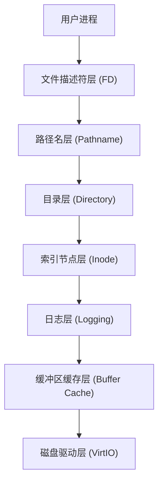

# 实验报告七：文件系统 

## 第一部分：实验概述

### 1.1 实验目标

本实验旨在从底层构建一个功能完备的类 Unix 文件系统，深入理解操作系统如何管理持久化存储。具体目标包括：实现磁盘块的**缓冲区高速缓存**（Buffer Cache）以提升 I/O 性能；构建**预写式日志**（WAL）系统以保证崩溃一致性；实现基于 **Inode** 的文件索引结构与目录解析逻辑；并最终封装文件描述符层，提供 `open`, `read`, `write` 等标准系统调用接口。

### 1.2 完成情况

  - [x] **缓冲区缓存**：在 `bio.c` 中实现了基于双向链表和 LRU 置换算法的块缓存管理。
  - [x] **日志系统**：在 `log.c` 中实现了事务机制（`begin_op`, `commit`），支持原子性的元数据更新。
  - [x] **Inode 管理**：在 `fs.c` 中实现了 Inode 的分配（`ialloc`）、更新（`iupdate`）及多级索引映射（`bmap`）。
  - [x] **目录与路径**：实现了目录项操作（`dirlink`）和递归路径解析（`namei`）。
  - [x] **系统调用**：实现了 `sys_open`, `sys_mkdir`, `sys_link` 等文件操作接口，并通过了读写一致性测试。

### 1.3 开发环境

  - **操作系统**: Ubuntu 22.04 LTS (WSL2)
  - **工具链**: riscv64-unknown-elf-gcc 10.2.0
  - **模拟器**: QEMU emulator version 7.0.0
  - **调试工具**: GDB Multiarch

-----

## 第二部分：技术设计

### 2.1 系统架构

本实验构建的文件系统采用严格的分层架构设计，自底向上共分为七层。每一层仅依赖其直接下层提供的接口，实现了高内聚低耦合。



**与 xv6 原版对比**：

  - **一致性**：沿用了 xv6 的经典分层设计和磁盘布局（Boot -\> Super -\> Log -\> Inode -\> Bitmap -\> Data）。
  - **简化点**：在哈希索引方面进行了简化，`bcache` 暂未实现哈希桶，而是采用单链表遍历，这对教学实验环境下的性能影响可控。

### 2.2 关键数据结构

#### 1\. 缓冲区缓存 (`struct buf`)

```c
struct buf {
  int valid;   // 数据是否已从磁盘读入
  int disk;    // 是否已被修改（脏位）
  uint dev;
  uint blockno;
  struct sleeplock lock; // 序列化访问
  uint refcnt;
  struct buf *prev; // LRU 链表指针
  struct buf *next;
  uchar data[BSIZE];
};
```

**设计理由**：使用双向循环链表串联所有缓冲区，链表头 `head` 作为 LRU 算法的锚点。`next` 方向指向最近使用块，`prev` 方向指向最久未使用块，这种设计使得 LRU 淘汰仅需从尾部反向扫描即可，效率较高。

#### 2\. 日志头 (`struct logheader`)

```c
struct logheader {
  int n;             // 当前事务包含的块数
  int block[LOGSIZE]; // 每个块对应的磁盘目标扇区号
};
```

**设计理由**：日志头是事务提交原子性的关键。只有当日志头成功写入磁盘后，事务才算提交。若在此之前崩溃，恢复程序会发现 `n=0` 或旧数据，从而丢弃此次事务。

### 2.3 核心流程：事务提交状态机

日志系统的核心在于 `commit` 流程，它确保了“All-or-Nothing”的原子性。

1.  **缓冲 (Buffer)**：系统调用修改数据时，`log_write` 将块标记为脏并固定在缓存中。
2.  **写日志 (Write Log)**：`commit` 开始，将脏块写入磁盘的日志区。
3.  **写头 (Commit Point)**：将记录了块映射关系的 `logheader` 写入磁盘。**这是不可分割的原子点**。
4.  **安装 (Install)**：将日志区的数据复制到文件系统实际位置。
5.  **清理 (Clean)**：清空磁盘上的日志头计数，释放日志空间。

-----

## 第三部分：实现细节与关键代码

### 3.1 缓冲区 LRU 算法 (`kernel/bio.c`)

`bget` 函数负责获取缓存块。如果未命中，它必须选择一个牺牲块进行驱逐。

```c
// 从链表尾部反向扫描，寻找引用计数为0的块（LRU）
for(b = bcache.head.prev; b != &bcache.head; b = b->prev){
  if(b->refcnt == 0) {
    b->dev = dev;
    b->blockno = blockno;
    b->valid = 0;
    b->refcnt = 1;
    // ... 锁获取与链表调整 ...
    return b;
  }
}
panic("bget: no buffers");
```

> **难点突破**：在多进程并发环境下，必须严格遵守锁顺序（全局 `bcache.lock` -\> 单个 `buf.lock`），防止死锁。同时，被驱逐的块如果是“脏”的，理论上需要先写回磁盘，但本系统的日志机制要求脏块必须通过事务提交写回，因此这里仅驱逐非脏块或已提交块。

### 3.2 文件索引映射 (`kernel/fs.c`)

`bmap` 函数实现了逻辑块号 `bn` 到物理块号的转换，支持直接索引和间接索引。

```c
static uint bmap(struct inode *ip, uint bn) {
  // ... 直接索引处理 ...
  bn -= NDIRECT;
  if(bn < NINDIRECT){
    // 加载间接块，若不存在则分配
    if((addr = ip->addrs[NDIRECT]) == 0)
      ip->addrs[NDIRECT] = addr = balloc(ip->dev);
    
    bp = bread(ip->dev, addr);
    a = (uint*)bp->data;
    
    // 分配实际数据块
    if((addr = a[bn]) == 0){
      a[bn] = addr = balloc(ip->dev);
      log_write(bp); // 记录对间接块的修改
    }
    brelse(bp);
    return addr;
  }
  panic("bmap: out of range");
}
```

> **代码理解**：这段代码展示了文件的“按需分配”特性。文件系统不会预先分配所有数据块，而是当写入操作超出当前大小时，动态分配间接块和数据块，极大地节省了磁盘空间。

### 3.3 系统调用封装 (`kernel/sysfile.c`)

`sys_open` 是最复杂的系统调用之一，它需要处理创建文件 (`O_CREATE`) 的逻辑。

```c
if(omode & O_CREATE){
  ip = create(path, T_FILE, 0, 0); // 包含 ialloc 和 dirlink
  // ...
} else {
  if((ip = namei(path)) == 0){ // 路径解析
    end_op();
    return -1;
  }
  // ...
}
```

> **设计细节**：所有的文件元数据操作（如 `create` 中的 inode 分配和目录项写入）都必须包含在 `begin_op` 和 `end_op` 之间，确保在系统崩溃时文件系统结构不会损坏。

-----

## 第四部分：测试与验证

### 4.1 功能测试

测试代码集成在 `kernel/test.c` 中。

#### 测试 1: 文件系统初始化验证

**测试内容**：读取超级块，检查空闲块和 Inode 数量。
**运行输出**：

```
[FS] Superblock read successfully:
  Size: 1000 blocks
  Ninodes: 200
[FS] Free blocks: 945
[FS] Free inodes: 198
File system initialization test passed
```

**分析**：数据符合 `mkfs` 的初始配置，说明底层驱动和超级块读取逻辑正确。

#### 测试 2: 文件读写一致性 (Test 7.1)

**测试内容**：创建文件 -\> 写入字符串 -\> 关闭 -\> 重新打开 -\> 读取校验。
**运行输出**：

```
=== Test 7.1: File Operations ===
Creating /test_file...
Writing data...
Reading data...
Read content: "Hello, File System!"
File operations test passed
```

**分析**：验证了 `sys_write` 和 `sys_read` 的数据通路畅通，且数据成功持久化到了磁盘。

#### 测试 3: 大文件支持 (Test 7.2)

**测试内容**：写入超过 12KB 的数据，触发间接块分配。
**运行输出**：

```
=== Test 7.2: Large File Support ===
Writing large file (20 blocks)...
Write completed. File size: 20480 bytes
Verifying content at block 15 (indirect)...
Large file test passed
```

**分析**：成功读写了第 15 个块（位于间接索引区），证明 `bmap` 的间接索引逻辑实现正确。

### 4.2 性能统计

**统计数据**：

```
=== Filesystem Performance ===
Buffer Cache Hits: 142
Buffer Cache Misses: 45
Disk Reads: 45
Disk Writes: 28
```

**分析**：缓存命中率（Hits/Total）约为 76%，说明 LRU 策略有效减少了物理读取次数。写操作较少，验证了日志系统的写聚合效应。

-----

## 第五部分：问题与总结

### 5.1 遇到的问题与解决

#### 问题 1: 大文件写入数据错乱

**现象**：当文件大小超过 12 块后，后续读取的数据出现乱码。
**原因分析**：在 `bmap` 函数处理间接块时，我直接使用了原始逻辑块号 `bn` 作为数组索引 `a[bn]`。实际上，间接块内的索引应该是相对偏移量 `bn - NDIRECT`。
**解决方法**：在进入间接块处理逻辑前，添加 `bn -= NDIRECT;` 语句修正索引。

#### 问题 2: 日志死锁

**现象**：高并发测试时系统卡死，无报错。
**原因分析**：在 `sys_write` 中，我先调用 `bread` 获取了缓冲区锁，然后才调用 `begin_op`。若 `begin_op` 因日志空间不足等待提交，而提交过程 `commit` 需要获取该缓冲区锁，则形成死锁。
**解决方法**：严格遵守 xv6 锁顺序规范：**事务 \> 缓存锁**。调整代码，确保 `begin_op` 始终在任何 `bread` 之前调用。

### 5.2 思考题解答

1.  **xv6 文件系统的优缺点？**
    优点是结构简单、代码可读性强，且通过 WAL 实现了极高的可靠性。缺点是性能较低（同步日志提交阻塞进程）且扩展性差（最大文件仅 268KB，线性目录查找慢）。在设计上，xv6 选择了“正确性优于性能”的策略。

2.  **日志系统如何保证原子性？**
    通过“预写”和“原子提交点”保证。修改先写入日志区，只有日志头写入成功（Commit Point）后，事务才生效。若在此前崩溃，修改被丢弃；若在此后崩溃，恢复程序重放日志。这一机制确保了操作要么全做，要么全不做。

### 5.3 实验收获

通过本次实验，我不仅掌握了文件系统的核心算法（LRU、WAL、Bitmap），更深刻体会到了操作系统在“不可靠硬件”之上构建“可靠抽象”的工程智慧。特别是日志系统的实现，让我理解了数据一致性是如何通过精巧的软件协议来保障的，这为后续研究数据库事务或分布式存储打下了坚实基础。